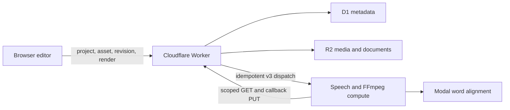

# subtitles — architecture

## Scope

`subtitles — by miithii` is a caption-first editor, not a nonlinear video
editor. Its durable model separates the video asset, editable document,
processing attempt, render attempt, and exported bytes so a retry cannot
silently change project history.

The creator chooses Assamese or Bodo. `codemix` controls how mixed-script words
are transcribed within that choice; it is not language detection.

## Control and compute planes

The Worker owns authorization and state transitions. Compute receives narrow,
job-scoped source, revision, state, and artifact URLs; those callback
capabilities are never returned to the browser.

## Durable resources

- `Project` is the stable identity and points to the current immutable head.
- `Asset` identifies the original or a derived media object. Large bytes live in
  R2; D1 stores declared and verified metadata.
- `ProcessingJob` is one idempotent transcription/alignment/coverage attempt
  against a source asset.
- `ProjectRevision` is a schema-versioned editor document containing the source
  reference, caption track, word timing/provenance, style, canvas, and export
  defaults. Revisions are immutable.
- `RenderJob` binds one revision to one export specification and renderer
  revision. It never reads the mutable project head.
- `ExportArtifact` records an uploaded video or caption file after its R2 object
  is durable. Export history is separate from revision history.

## End-to-end state flow

1. The browser creates a project, reserves an asset, and streams the source to
   R2.
2. The Worker creates a processing job and dispatches `/v3/processing-jobs`.
3. Compute transcribes, aligns, runs bounded coverage recovery, and projects
   generated words onto one strictly ordered millisecond timeline before it
   returns an editor document through scoped callbacks. Small acoustic jitter is
   normalized silently; substantial repairs remain editable and are marked for
   timing review instead of failing the processing job.
4. The Worker validates the document and trusted speech intervals, stores the
   first revision, and advances the project head.
5. The browser edits locally. A save supplies the exact base revision; a stale
   base returns `revision_conflict` rather than overwriting another head.
6. Export submits `{revisionId, exportSpec}`. An idempotency key plus immutable
   request fingerprint prevents duplicate jobs from changing meaning.
7. Compute verifies the revision hash and available source facts, renders the
   requested outputs, and uploads them through artifact callbacks.
8. Render success is committed only after the required video artifact exists in
   both R2 and D1. The browser polls that job and downloads its exact artifact.

## Enforced invariants

1. A render can use only a saved immutable revision, never an unsaved draft.
2. Revision saves use optimistic concurrency and cannot silently replace a
   newer project head.
3. Editor revisions must preserve the source asset and the trusted
   server-produced speech baseline from the first processing revision.
4. Processing and rendering are idempotent. Reusing an identity with different
   immutable input is a conflict.
5. `review_required` is an honest terminal processing result. It remains
   editable but is not renderable until a new revision passes coverage checks
   and every automatically repaired timing marker has been manually reviewed.
6. Current coverage policy requires at least 99.5% speech coverage, no residual
   uncovered interval over 250 ms, credible word spans, and excludes placeholder
   captions. Passing this policy does not claim every audio sample is speech.
7. A render succeeds only after its required durable artifact exists.
8. Browser recovery stores serializable project/editor state only. It never
   persists `File`, Blob/object URLs, playback elements, or bearer capabilities.
9. The original video is immutable and never overwritten by an export.

## Compatibility boundary

The durable project surface is primary for hosted uploads:

- browser: `/api/projects/...`
- compute: `/v3/processing-jobs` and `/v3/render-jobs`

`/v1/jobs` remains the direct local/configured compute workflow.
`/api/media/jobs` and compute `/v2/jobs` remain solely for recovery of older
hosted drafts. They are compatibility paths, not an alternative model for new
features.

## Honest operational limits

- Direct Worker-to-compute dispatch has a bounded callback lease and owner-poll
  redrive. It is not an autonomous queue, does not retry while nobody polls,
  and is not a substitute for Cloudflare Queues or Workflows.
- Upload is a single streamed PUT. A broken connection restarts it; resumable
  multipart upload is not implemented.
- The authenticated source is range-served for preview. Proxy video, HLS,
  thumbnail strips, and waveforms are future derived assets.
- Project ownership is a SameSite HttpOnly capability cookie. Account identity,
  collaboration, quota, retention controls, and orphan reconciliation are not
  implemented.
- Upload finalization does not pretend to know facts it has not measured.
  Source checksum, duration, dimensions, frame rate, and codec facts become
  authoritative only when a trusted stage supplies them.
- Speech transcription and alignment rely on external services and can require
  manual correction for music, crosstalk, unsupported speech, or transcript
  errors.
- ASS/FFmpeg supports the caption-only renderer. A general scene/layer graph is
  deliberately outside this architecture.

## Next reliability work

1. Queue or Workflow orchestration with autonomous retries and cancellation
   reconciliation.
2. Resumable upload plus derived preview assets.
3. Account ownership, quota, retention/deletion, and operational observability.
4. Only after those boundaries are dependable, consider collaboration or a
   generalized composition graph.
