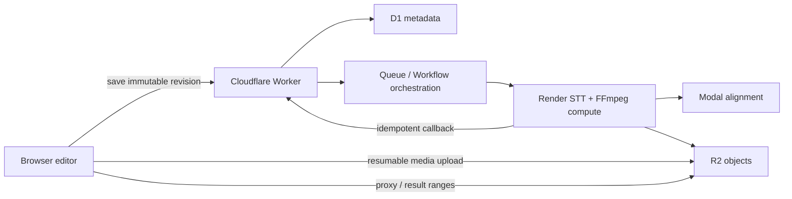

# Project, revision, and render boundaries

Status: accepted for incremental implementation.

## Why this boundary exists

The original SyncWord job object combines upload state, editable captions,
style, alignment diagnostics, and rendered artifacts. That is convenient for a
single caption pass, but it makes autosave, history, retries, and reproducible
exports ambiguous.

The Kapwing editor request inventory showed a useful separation of concerns:

- a video/studio document is fetched independently from its assets;
- uploads first obtain a resumable upload URL and transfer directly to object
  storage;
- thumbnails and HLS preview fragments are derived asset representations;
- snapshot history and export history are separate resources;
- asset-scoped AI jobs are queried independently from the project document.

Those observations come from browser-visible request URLs and loaded assets,
not private response bodies or a complete DevTools HAR. The design below copies
the boundaries, not Kapwing's implementation or endpoint names.

## Domain model

`Project`
: Stable identity, title, owner/capability, and a pointer to the latest saved
  revision. A project is not a processing job.

`Asset`
: Immutable source or derived media metadata. Large bytes live in R2; D1 keeps
  identity, ownership, media facts, hashes, and object keys. Derived assets
  reference their source asset.

`ProjectRevision`
: Immutable, schema-versioned editor document. It references assets and owns
  caption tracks, style, and export defaults. Saving creates a new revision
  with an optimistic `baseRevisionId`; it never mutates an old revision.

`CaptionTrack`
: Editable phrases/words plus language, timing provenance, and speech-coverage
  diagnostics. `review_required` is a valid terminal processing state but is
  not renderable until a human repairs and saves a new revision.

`ProcessingJob`
: A bounded STT/alignment/coverage attempt. Retries are recorded as attempts
  and never overwrite project history.

`RenderJob`
: An immutable snapshot of `projectId`, `revisionId`, `exportSpec`, renderer
  revision, and idempotency key. A render never reads the mutable project head.

`ExportArtifact`
: The durable output record (R2 key, size, media facts, checksum, timestamps,
  and failure/result status). Export history belongs to a project and remains
  separate from revision history.

## Required invariants

1. The browser may edit a local draft, but server renders only a saved,
   immutable revision.
2. Saving with a stale `baseRevisionId` returns a conflict; it never silently
   overwrites a newer head.
3. The same render idempotency key and immutable input produce the same
   `RenderJob` identity rather than duplicate work.
4. Caption tracks with unresolved speech-active gaps cannot enter the render
   queue. One bounded targeted retry is allowed; the next terminal state is
   `review_required`, not a misleading `ready`.
5. D1 stores relational metadata and revision pointers. R2 stores source media,
   revision documents when they outgrow a row, previews, captions, and exports.
6. Upload data goes directly to object storage through a resumable session;
   application Workers authorize and finalize it but do not buffer a large
   video body.
7. Queue consumers and workflow steps are at-least-once safe. Each external
   STT/alignment/render action has a stable attempt/idempotency key and commits
   state only after its artifact is durable.
8. Preview media is a derived asset (thumbnail strip plus seekable proxy/HLS),
   never confused with the source or final export.
9. Client recovery persists only serializable editor state. `File`, Blob/object
   URLs, playback elements, and bearer capabilities are never written to the
   draft store.
10. ASS remains the caption-only fast render path. General scene/layer editing
    requires a separate composition graph and is outside this architecture.

## Control and compute planes



The Worker is the authorization and state-transition boundary. FFmpeg and the
speech models stay on the existing compute plane. A Cloudflare Workflow can
orchestrate durable external calls and retries, but it does not replace the
media compute service.

## Caption processing state machine

```text
queued -> extracting -> transcribing -> aligning -> validating
                                         |             |
                                         |             +-> ready
                                         |             +-> targeted_retry
                                         |                    |
                                         |                    +-> ready
                                         |                    +-> review_required
                                         +-> failed
```

`ready` means both timing quality and speech coverage pass. `review_required`
keeps the best captions and diagnostics available to the editor while the
render boundary remains closed.

## Delivery sequence

1. Coverage validation, bounded missing-window retry, and render guard.
2. Schema-versioned local drafts plus undo/redo and crash recovery.
3. D1 project/asset/revision metadata with optimistic immutable saves.
4. Render snapshot/idempotency and durable export history.
5. Resumable uploads, derived preview assets, and durable orchestration.
6. Only then consider collaboration or a generalized scene/layer graph.

This keeps SyncWord's defensible caption-first workflow while adopting the
reliability and separations that make a larger editor feel safe.
